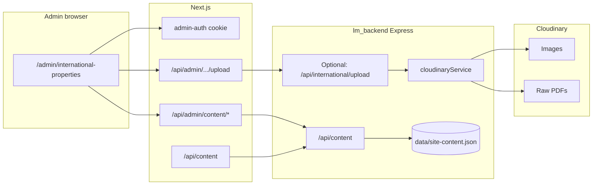

# International properties — Admin (Approach 2) + Cloudinary

Elaborated implementation plan: editable international listings from the London Move admin UI, with images and PDF brochures stored on **Cloudinary**. Public site reads published data via the existing **site content** pipeline (`site-content.json` + content API).

**Work breakdown (tickets):** [international-properties-admin-tickets.md](./international-properties-admin-tickets.md)

---

## 1. Goals

| Goal | Detail |
|------|--------|
| **CRUD from admin** | Add, edit, delete international “developments” without redeploying or editing JSON by hand. |
| **Media on Cloudinary** | Hero image, gallery images, and brochure PDFs uploaded through admin; **only HTTPS URLs** (and optional metadata) stored in CMS JSON. |
| **Single source of truth** | One content key (e.g. `international.properties`) holds a **JSON array** string, same pattern as other `json`-type site content. |
| **Public parity** | `/international-properties` loads the same shape as today (`PropertyData`-like), from API + fallback. |

### Non-goals (initial phase)

- Rentman integration for international stock.
- Per-asset ACL / signed URLs for brochures (can be phase 2).
- Replacing Embayt branding or partner copy (can stay static or move to separate content keys later).

---

## 2. Current state vs target

### Today

- Data: `lm_frontend/public/data/properties.json` (static fetch).
- Types: `lm_frontend/src/app/international-properties/types.ts` (`PropertyData`).
- Media: mostly Vercel Blob URLs; some `/placeholder-property.jpg`.
- Admin: no international section; site copy uses `CONTENT_REGISTRY` + `contentApi` → `lm_backend/data/site-content.json`.

### Target

- Data: **`international.properties`** (or agreed key) in **`site-content.json`**, `type: json`, `value` = stringified array of records.
- Public page: `GET` Next **`/api/content?keys=international.properties`** (or backend direct), parse JSON, render; **fallback** to bundled default or legacy `properties.json` if missing/error.
- Admin: dedicated **`/admin/international-properties`** with list + editor + **upload to Cloudinary**.

---

## 3. Architecture overview



**Principle:** binaries never go inside `site-content.json`; only **URLs** returned from Cloudinary (`secure_url`) and optionally **`public_id`** for deletes/replaces.

---

## 4. Data model

### 4.1 Registry entry (frontend)

Add to `lm_frontend/src/lib/content-registry.ts`:

- **key:** `international.properties` (dot-separated, consistent with other keys).
- **label:** e.g. “International properties (JSON)”.
- **group:** `international`.
- **type:** `json`.
- **defaultValue:** stringified array matching current `properties.json` (migration seed).

### 4.2 `PropertyData` evolution

Extend `PropertyData` (or a v2 type) to support brochures explicitly, for example:

| Field | Type | Purpose |
|-------|------|---------|
| `title` | string | Card + modal title |
| `cardDescription` | string | Card blurb |
| `image` | string | Hero/card image URL (Cloudinary) |
| `images` | string[] | Gallery URLs |
| `modalDescription` | string[] | Paragraphs |
| `ctas` | `{ label, href }[]` | Links; `href` may point to PDF or external pages |
| **`brochureUrl`** (optional) | string | Direct Cloudinary **raw** URL for PDF (in addition or instead of a CTA) |
| **`imagePublicIds`** (optional) | string[] | If you want reliable delete/replace without parsing URLs |

**Recommendation:** Start with **URLs only** (`image`, `images`, `brochureUrl`, `ctas[].href`). Add `publicId` fields only if you implement **delete asset** or **replace** flows in Cloudinary.

### 4.3 Validation

Before saving the content key:

- `JSON.parse` the draft string.
- Assert `Array.isArray`.
- For each item: required `title`, `image`, `cardDescription`; `images` array; `modalDescription` array; `ctas` array with valid URLs or `#` during draft.
- Optional: `zod` schema shared between admin save and a small server check in `PUT /api/admin/content`.

---

## 5. Cloudinary strategy

### 5.1 Folder layout

Use a **dedicated folder** separate from Rentman sync, e.g.:

- `CLOUDINARY_FOLDER_INTERNATIONAL=international-properties`  
  or subfolder under existing account: `rentman-properties/international` (less isolated).

**Recommendation:** **`international-properties`** at account root (or env-driven) so Rentman migrations and wipes never touch these assets.

### 5.2 Resource types

| Asset | Cloudinary `resource_type` | Notes |
|-------|----------------------------|--------|
| Card / hero / gallery | `image` | Reuse patterns from `cloudinaryService` (upload from buffer/base64; optional eager transforms for web delivery). |
| Brochure PDF | `raw` | Upload PDF as **raw**; store `secure_url` in JSON. |

### 5.3 Backend service extensions (`lm_backend`)

Today `CloudinaryService` is image-oriented (`uploadBase64Image`, etc.). Plan to add, for example:

- `uploadImageBuffer(buffer, mimeType, suggestedFilename)` → `{ secure_url, public_id, ... }`.
- `uploadRawBuffer(buffer, filename)` → PDF / future doc types, `resource_type: 'raw'`.

Naming: include a short random suffix or UUID in `public_id` to avoid collisions on re-upload with same title.

### 5.4 Environment

Backend (already): `CLOUDINARY_CLOUD_NAME`, `CLOUDINARY_API_KEY`, `CLOUDINARY_API_SECRET`, plus new optional `CLOUDINARY_FOLDER_INTERNATIONAL`.

Frontend: if any **unsigned** browser upload is used (not recommended for admin), you’d need upload presets; **preferred** is **server-side only** upload so secrets stay on the server.

---

## 6. Upload API design (recommended)

Admin cookie lives on **Next.js**; backend does not see it. Two robust patterns:

### Option A (recommended): Next.js proxies to backend

1. **`POST /api/admin/international/upload`** (Next Route Handler):
   - Verify `admin-auth` cookie (same semantics as other `/api/admin/*` routes).
   - Read `multipart/form-data` (file + `kind: 'image' | 'pdf'`).
   - Forward to backend **`POST /api/international/media/upload`** with **`Authorization: Bearer <INTERNAL_SECRET>`** (or `X-Admin-Internal-Token`) and the file stream/buffer.
2. **Backend** validates internal secret, calls `CloudinaryService`, returns `{ secure_url, public_id, resourceType }`.

**Pros:** Cloudinary secrets only on backend. **Cons:** One shared secret in both `.env` files; must rotate if leaked.

### Option B: Upload entirely in Next.js

- Next route uses `cloudinary` package + env vars on the **frontend** deployment.

**Pros:** Simpler request path. **Cons:** Duplicate Cloudinary config; secrets must exist in Vercel env for the Next app.

**Plan recommendation:** **Option A** for alignment with `lm_backend/docs/cloudinary-integration.md` and single place for media logic.

### Request/response sketch

**Request:** `multipart/form-data`

- `file`: binary
- `kind`: `image` | `pdf`

**Response:**

```json
{
  "success": true,
  "data": {
    "secureUrl": "https://res.cloudinary.com/...",
    "publicId": "international-properties/uuid-filename",
    "resourceType": "image"
  }
}
```

---

## 7. Admin UI (`/admin/international-properties`)

### 7.1 Navigation

- Add card on `lm_frontend/src/app/admin/page.tsx` → “International properties”.

### 7.2 Page behaviour

1. **Load:** `GET /api/admin/content` (include unpublished) or fetch single key; merge with registry default if key missing (see §8).
2. **List:** Table or cards: title, thumbnail (from `image`), actions Edit / Delete.
3. **Editor (drawer or separate route):**
   - Fields: title, card description, modal paragraphs (dynamic list), CTAs (label + href), gallery URLs (list).
   - **Upload widgets:** “Card image”, “Add gallery image”, “Brochure (PDF)” → call upload API → insert returned URL into form state.
4. **Save:** Serialize array → `JSON.stringify` → `PUT /api/admin/content/international.properties` (existing flow) with `type: 'json'`.
5. **Validation errors:** Show inline; block save if JSON invalid.

### 7.3 `json` type in Site Content page (optional improvement)

Either:

- Hide `international.properties` from generic `/admin/content` to avoid double editing, **or**
- Show read-only notice: “Managed under International properties” with link.

---

## 8. Bootstrap & migration

### 8.1 Chicken-and-egg

Admin list today only shows content keys **already present** in `site-content.json`. Fix one of:

1. **Seed script** (Node): read `public/data/properties.json`, `PUT` content API once with admin session or direct file write for dev.
2. **Admin loader change:** when building the list for `/admin/content`, **merge** `CONTENT_REGISTRY` keys that have no entry yet, using `defaultValue` as `draftValue` (best long-term UX).

### 8.2 One-time migration checklist

- [ ] Add registry definition + default JSON.
- [ ] Seed `site-content.json` with current listings (URLs can stay Blob until re-uploaded).
- [ ] Deploy backend + frontend.
- [ ] Smoke-test public `/international-properties`.
- [ ] Optionally re-upload media to Cloudinary and update URLs in admin.

---

## 9. Public site changes

**File:** `lm_frontend/src/app/international-properties/page.tsx`

1. Replace `fetch('/data/properties.json')` with `fetch('/api/content?keys=international.properties')`.
2. Parse `data[0].value` as JSON array.
3. **Fallback:** if empty/404, use `import defaultInternational from '@/...'` or static copy of `properties.json` once as `DEFAULT_INTERNATIONAL_PROPERTIES`.
4. Keep `PropertyModal` / types in sync with extended `PropertyData`.

**Caching:** Consider `next: { revalidate: 60 }` if you move fetch to server component later; for client fetch, optional SWR or short TTL is enough initially.

---

## 10. Security

| Risk | Mitigation |
|------|------------|
| Unauthorized upload | Only Next route with valid `admin-auth`; backend requires internal secret. |
| Unauthorized content change | Existing `PUT /api/admin/content/[key]` cookie check. |
| SSRF / huge files | Max body size on upload route; reject non-image MIME for `kind=image`; PDF max size cap (e.g. 15 MB). |
| XSS in text fields | React escapes text; if any HTML is allowed later, sanitize. |
| Secrets in repo | Never commit Cloudinary secret; document `INTERNAL_UPLOAD_SECRET` in `.env.example` without real values. |

---

## 11. Phased delivery

### Phase 1 — Foundation

- [ ] Add `international.properties` to `CONTENT_REGISTRY` (`type: json`).
- [ ] Seed or merge-default logic for admin visibility.
- [ ] Public page reads from `/api/content` with fallback.
- [ ] Smoke-test create/edit via raw `PUT` or temporary textarea in Site Content (optional).

### Phase 2 — Cloudinary upload

- [ ] Extend `CloudinaryService` (image + raw PDF).
- [ ] Backend `POST /api/international/media/upload` + internal auth.
- [ ] Next `POST /api/admin/international/upload` proxy.

### Phase 3 — Admin UI

- [ ] `/admin/international-properties` list + editor + upload buttons.
- [ ] Extend `PropertyData` + modal for `brochureUrl` if needed.
- [ ] Remove or deprecate static `public/data/properties.json` from primary path (keep as fallback file optional).

### Phase 4 — Hardening

- [ ] Zod validation shared or duplicated minimal checks.
- [ ] Optional: delete old Cloudinary asset when replacing `public_id`.
- [ ] Monitoring/logging on upload failures.

---

## 12. Testing

| Area | Test |
|------|------|
| Content API | GET published includes key; PUT updates file on disk |
| Upload | Image + PDF return `secure_url`; wrong MIME rejected |
| Admin | Unauthenticated upload returns 401 |
| Public | Page renders with API data; fallback when API down |
| Regression | International office page unchanged |

---

## 13. Deployment notes

- **Backend:** `data/site-content.json` must be on **persistent volume** in production (same as today for site content).
- **Cloudinary:** Free tier limits; PDF **raw** storage counts toward usage — monitor dashboard.
- **CORS:** If admin upload hits backend directly from browser (not recommended), align CORS; proxy pattern avoids this.

---

## 14. Open decisions

1. **Exact content key string** — `international.properties` vs `international.listings` (pick one and keep stable).
2. **Orphan assets** — whether to store `public_id` and implement delete on record removal.
3. **Brochure UX** — dedicated `brochureUrl` vs only `ctas` with PDF `href`.
4. **Internal secret name** — `ADMIN_INTERNAL_TOKEN` vs `INTERNATIONAL_UPLOAD_SECRET`.

---

## 15. Reference files (existing codebase)

| Area | Path |
|------|------|
| Site content routes | `lm_backend/src/server/routes/content.ts` |
| Cloudinary service | `lm_backend/src/utils/cloudinaryService.ts` |
| Cloudinary doc | `lm_backend/docs/cloudinary-integration.md` |
| Admin content UI | `lm_frontend/src/app/admin/content/page.tsx` |
| Admin content API | `lm_frontend/src/app/api/admin/content/*.ts` |
| Public content API | `lm_frontend/src/app/api/content/route.ts` |
| International page | `lm_frontend/src/app/international-properties/page.tsx` |
| Types | `lm_frontend/src/app/international-properties/types.ts` |
| Static data (current) | `lm_frontend/public/data/properties.json` |

---

*Document version: 1.0 — Approach 2 + Cloudinary storage plan.*
